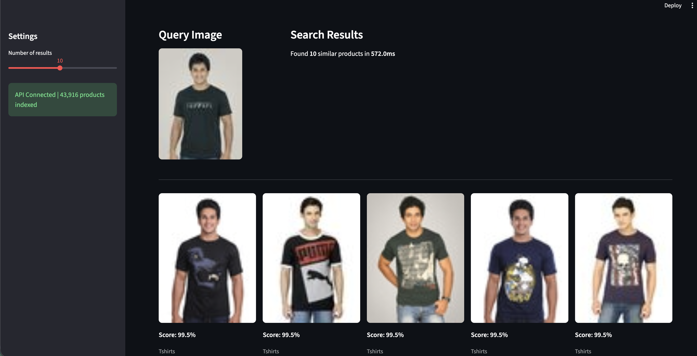
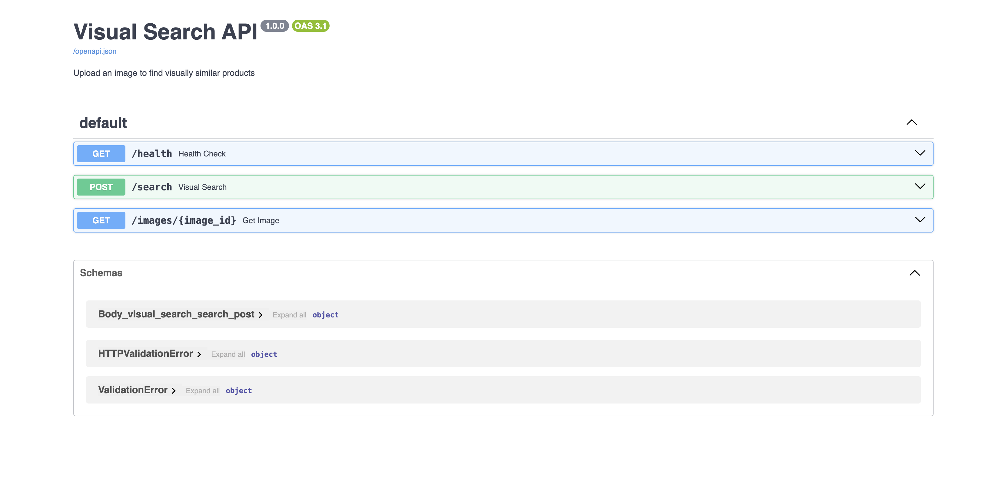
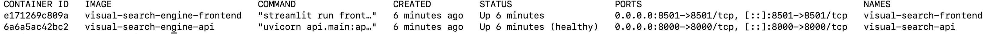

# Visual Search & Recommendation Engine

A production-grade visual search system that finds visually similar fashion products using deep learning and approximate nearest neighbor search.

**Upload a fashion image → Get visually similar products in milliseconds.**

## Demo

### Search Results


### API Documentation (Swagger UI)


### Docker Containers Running


## Architecture

```
┌─────────────────────────────────────────────────────────────────────┐
│                        VISUAL SEARCH ENGINE                         │
│                                                                     │
│  ┌──────────────┐     ┌──────────────┐     ┌────────────────────┐  │
│  │   Streamlit   │────▶│   FastAPI     │────▶│  ResNet50 + FC     │  │
│  │   Frontend    │     │   Backend     │     │  (Feature Extract)  │  │
│  │   Port 8501   │◀────│   Port 8000   │◀────│  2048-dim embed.   │  │
│  └──────────────┘     └──────┬───────┘     └────────────────────┘  │
│                              │                                      │
│                              ▼                                      │
│                       ┌──────────────┐                              │
│                       │  FAISS Index  │                              │
│                       │  43,916 items │                              │
│                       │  Flat (exact) │                              │
│                       └──────────────┘                              │
└─────────────────────────────────────────────────────────────────────┘
```

## Key Results

| Metric | Score |
|--------|-------|
| Precision@5 | 82.61% |
| MRR (Mean Reciprocal Rank) | 90.22% |
| mAP@10 | 86.79% |
| Search Latency (median) | 6.81ms |
| Index Size | 43,916 products |

## Tech Stack

- **Model**: ResNet50 fine-tuned with Triplet Loss (batch hard mining)
- **Indexing**: FAISS (Facebook AI Similarity Search) — Flat index with L2 distance
- **Backend**: FastAPI with async endpoints
- **Frontend**: Streamlit with real-time search
- **Containerization**: Docker + Docker Compose
- **CI/CD**: GitHub Actions (lint + test + Docker verify)
- **Registry**: Docker Hub

## Quick Start

### Option 1: Docker (recommended)
```bash
docker pull pooja2509/visual-search-engine:latest
docker run -p 8000:8000 pooja2509/visual-search-engine:latest
```

### Option 2: Docker Compose (API + Frontend)
```bash
git clone https://github.com/pooja2509/visual-search-engine.git
cd visual-search-engine
docker compose up --build
# API:      http://localhost:8000
# Frontend: http://localhost:8501
```

### Option 3: Local Development
```bash
git clone https://github.com/pooja2509/visual-search-engine.git
cd visual-search-engine
python -m venv venv
source venv/bin/activate
pip install -r requirements.txt

# Start API
uvicorn api.main:app --port 8000

# Start Frontend (new terminal)
streamlit run frontend/app.py
```

## Project Structure

```
visual-search-engine/
├── api/                          # FastAPI backend
│   ├── config.py                 # Central configuration
│   ├── model.py                  # ResNet50 embedding extractor
│   ├── search.py                 # FAISS search engine
│   └── main.py                   # API endpoints
├── frontend/
│   └── app.py                    # Streamlit UI
├── tests/                        # 47 tests (pytest)
│   ├── test_config.py            # Configuration tests
│   ├── test_model.py             # Embedding model tests
│   └── test_api.py               # API endpoint tests
├── notebooks/                    # Development notebooks
│   ├── 01_exploration.ipynb      # Data analysis
│   ├── 02_data_split.ipynb       # Train/val/test split
│   ├── 04_faiss_indexing.ipynb   # Index experiments
│   └── 05_evaluation.ipynb       # Metrics evaluation
├── .github/workflows/ci.yml     # CI/CD pipeline
├── Dockerfile                    # Container definition
├── docker-compose.yml            # Multi-container setup
└── requirements.txt              # Python dependencies
```

## How It Works

### 1. Data Pipeline
- **Dataset**: Fashion Product Images (Small) — 44,441 images across 143 categories
- **Split**: 70% train / 15% validation / 15% test (stratified by category)
- **Preprocessing**: Resize to 256px, center crop to 224px, ImageNet normalization

### 2. Model Training
- **Base Model**: ResNet50 pretrained on ImageNet
- **Fine-tuning**: Froze layers 1-3, trained layer4 only (58.6% of parameters)
- **Loss**: Triplet Loss with batch hard mining (margin=0.3)
- **Sampling**: Balanced batches — 16 classes x 4 images = 64 per batch
- **Training**: 11 epochs, early stopped at epoch 8 (patience=3)
- **Improvement**: Baseline 72% → Fine-tuned 78.8% average P@5

### 3. Indexing & Search
- **Embeddings**: 2048-dimensional L2-normalized vectors
- **Index**: FAISS Flat index (exact search, 100% recall)
- **Distance**: L2 distance converted to cosine similarity
- **Benchmarked**: Flat vs IVF vs IVF+PQ — chose Flat for 44K dataset

### 4. API Design
- `GET /health` — Health check with model/index status
- `POST /search` — Upload image, get top-K similar products
- `GET /images/{id}` — Serve product images

### 5. Evaluation
Evaluated on 6,588 test queries across 13 product categories:

| Category | P@5 | P@10 |
|----------|-----|------|
| Sunglasses | 100.0% | 99.8% |
| Watches | 96.1% | 94.9% |
| Flip Flops | 94.3% | 90.2% |
| Tops | 67.4% | 62.2% |

## Design Decisions

| Decision | Choice | Why |
|----------|--------|-----|
| Model | ResNet50 | Best accuracy/speed tradeoff for embeddings |
| Fine-tuning | Layer4 only | Sufficient for domain adaptation, faster training |
| Loss | Triplet + Batch Hard | Better than contrastive for retrieval tasks |
| Index | FAISS Flat | 100% recall, fast enough for 44K items |
| Framework | FastAPI | Async support, auto-docs, type validation |
| Frontend | Streamlit | Rapid prototyping, Python-native |
| Container | Docker | Reproducible, portable deployment |

## Running Tests

```bash
# Run all tests (47 tests)
python -m pytest tests/ -v

# Run specific test file
python -m pytest tests/test_api.py -v

# Run with coverage
python -m pytest tests/ -v --cov=api
```

## License

This project is for educational and portfolio purposes.
Dataset: [Fashion Product Images (Small)](https://www.kaggle.com/datasets/paramacharya/fashion-product-images-small) from Kaggle.
